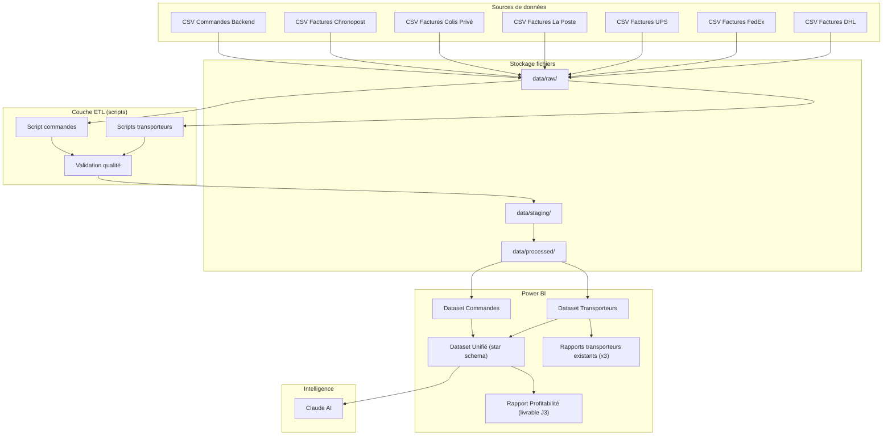
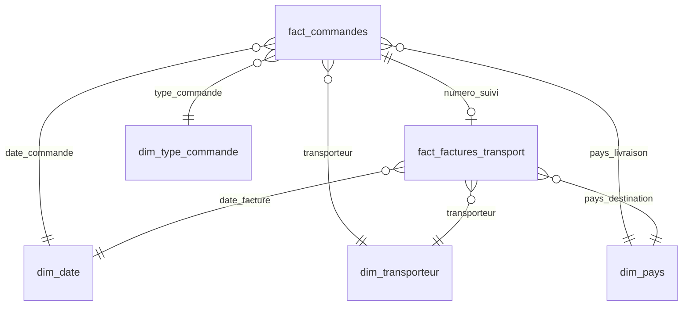

# Architecture data — Lireka Power BI

> **Référence contractuelle** : [`../../project/devis.md`](../../project/devis.md)  
> **Version** : 2.0 — Aligné devis (4 jours)  
> **Date** : 12 juillet 2026  
> **Auteur** : Otmane Boulahia — ZineInsights  
>
> *Document de travail technique — support à l'intégration. Le livrable contractuel est la documentation du processus (`docs/04-processus/`).*

---

## 1. Vue d'ensemble



---

## 2. Modèle de données cible (Star Schema)

### 2.1 Table de faits — `fact_commandes`

| Colonne | Type | Source | Description |
|---------|------|--------|-------------|
| `id_commande` | string | Backend | PK |
| `date_commande` | date | Backend | FK → dim_date |
| `pays_livraison` | string | Backend | FK → dim_pays |
| `type_commande` | string | Backend | FK → dim_type_commande |
| `transporteur` | string | Backend | FK → dim_transporteur |
| `numero_suivi` | string | Backend | Clé de liaison |
| `ca_ht` | decimal | Backend | Chiffre d'affaires HT |
| `cout_achat` | decimal | Backend | Coût d'achat livres |
| `cout_transport_estime` | decimal | Backend | Estimation backend |
| `cout_transport_reel` | decimal | Factures | **Coût réel (facture)** |
| `marge_brute` | decimal | Calculé | ca_ht - cout_achat - cout_transport_reel |
| `taux_marge` | decimal | Calculé | marge_brute / ca_ht |

### 2.2 Table de faits — `fact_factures_transport`

| Colonne | Type | Source | Description |
|---------|------|--------|-------------|
| `id_facture` | string | Factures | PK |
| `date_facture` | date | Factures | FK → dim_date |
| `numero_suivi` | string | Factures | Clé de liaison |
| `transporteur` | string | Factures | FK → dim_transporteur |
| `cout_transport` | decimal | Factures | Montant facturé |
| `poids` | decimal | Factures | Poids colis (kg) |
| `pays_destination` | string | Factures | FK → dim_pays |
| `service` | string | Factures | Type de service |

### 2.3 Tables de dimensions

| Table | Clés | Attributs |
|-------|------|-----------|
| `dim_date` | `date` | année, trimestre, mois, semaine, jour_semaine |
| `dim_pays` | `code_pays` | nom_pays, zone_geo, continent |
| `dim_transporteur` | `transporteur` | nom, type (express/standard), actif |
| `dim_type_commande` | `type_commande` | libellé, catégorie (B2C/B2B) |

### 2.4 Relations



---

## 3. Flux ETL

### 3.1 Pipeline transporteurs

```
1. INGESTION     CSV brut → data/raw/transporteurs/{transporteur}/
2. VALIDATION    Schéma, types, valeurs manquantes, doublons
3. TRANSFORMATION Mapping → schéma unifié, nettoyage n° suivi
4. CHARGEMENT    → data/processed/transporteurs/factures_unifiees.csv
5. REFRESH       Power BI dataset
```

### 3.2 Pipeline commandes

```
1. INGESTION     CSV backend → data/raw/commandes/
2. VALIDATION    Schéma, types, PII check
3. TRANSFORMATION Typage dates, calculs dérivés, pseudonymisation
4. CHARGEMENT    → data/processed/commandes/commandes_clean.csv
5. REFRESH       Power BI dataset
```

### 3.3 Pipeline unification (J3)

```
1. JOINTURE      fact_commandes.numero_suivi = fact_factures.numero_suivi
2. ENRICHISSEMENT cout_transport_reel ← facture (remplace estimé)
3. CALCUL        marge_brute, taux_marge, ecart_cout
4. RAPPORT       Taux de matching, anomalies
```

---

## 4. Règles de nettoyage — Numéro de suivi

| Règle | Description | Exemple |
|-------|-------------|---------|
| TRIM | Supprimer espaces début/fin | `" 123ABC "` → `"123ABC"` |
| UPPER | Normaliser en majuscules | `"abc123"` → `"ABC123"` |
| PREFIX | Supprimer préfixes transporteur si présents | `"DHL-123"` → `"123"` |
| FORMAT | Valider longueur minimale | Rejet si < 5 caractères |
| DEDUP | Conserver la facture la plus récente en cas de doublon | |

---

## 5. Mesures DAX clés

```dax
// Coût transport réel (depuis factures)
Coût Transport Réel = SUM(fact_commandes[cout_transport_reel])

// Coût transport estimé (depuis backend)
Coût Transport Estimé = SUM(fact_commandes[cout_transport_estime])

// Écart coût
Écart Coût Transport = [Coût Transport Réel] - [Coût Transport Estimé]

// Marge brute réelle
Marge Brute = SUM(fact_commandes[ca_ht]) - SUM(fact_commandes[cout_achat]) - [Coût Transport Réel]

// Taux de marge
Taux Marge Brute = DIVIDE([Marge Brute], SUM(fact_commandes[ca_ht]), 0)

// Taux de matching
Taux Matching = DIVIDE(
    COUNTROWS(FILTER(fact_commandes, NOT(ISBLANK([cout_transport_reel])))),
    COUNTROWS(fact_commandes),
    0
)

// Nombre de commandes
Nb Commandes = COUNTROWS(fact_commandes)

// Coût moyen par colis
Coût Moyen Colis = DIVIDE([Coût Transport Réel], [Nb Commandes], 0)
```

---

## 6. Architecture Power BI

### 6.1 Workspaces

| Workspace | Contenu | Accès |
|-----------|---------|-------|
| `Lireka - Transport` | Dashboards transporteurs existants (DHL, FedEx, UPS) + données intégrées La Poste / Colis Privé / Chronopost | Logistique, Direction |
| `Lireka - Profitabilité` | Dashboard profitabilité *(1 rapport, 2 axes : pays + type de commande)* | Direction, Finance |
| `Lireka - Formation` | Sandbox utilisateurs | Tous |

### 6.2 Stratégie de refresh

| Dataset | Mode | Fréquence | Source |
|---------|------|-----------|--------|
| Transporteurs | Import | Mensuel (post-facturation) | CSV processed |
| Commandes | Import | Hebdomadaire | CSV backend |
| Unifié | Import | Mensuel | Jointure processed |

---

## 7. Sécurité & conformité

| Aspect | Mesure |
|--------|--------|
| Données brutes | Stockées localement, non versionnées (`.gitignore`) |
| PII | Pseudonymisation des champs client dans les exports |
| Accès Power BI | RLS (Row-Level Security) si nécessaire par équipe |
| Rétention | Données brutes : 3 mois rolling ; processed : 24 mois |
| RGPD | Accord de traitement ZineInsights ↔ Lireka |

---

*Architecture à valider avec le référent technique Lireka après kick-off.*
