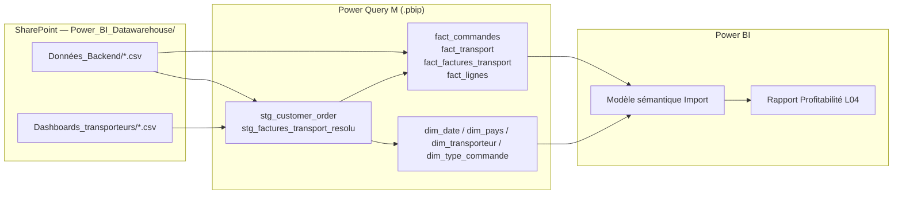
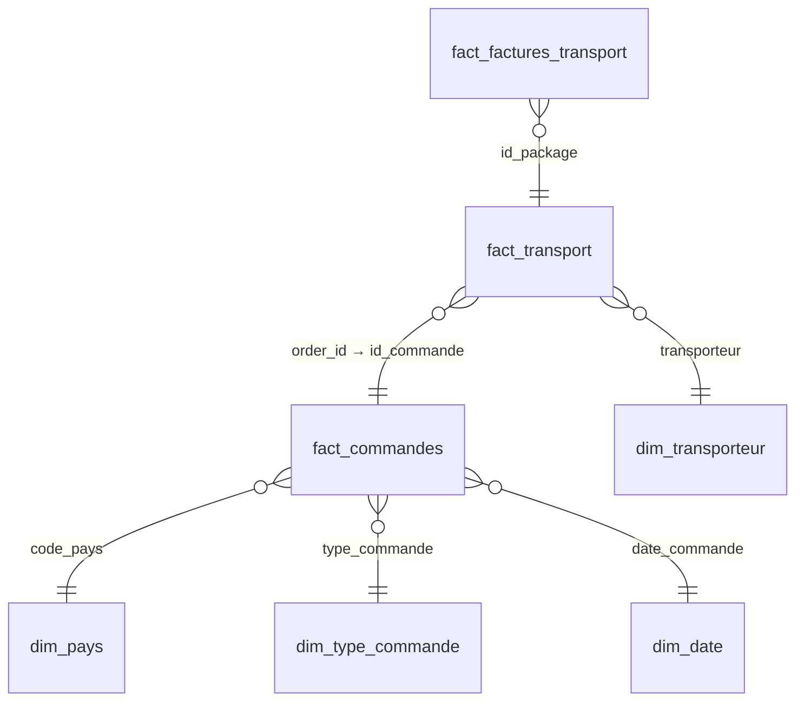

# Architecture data — Lireka Power BI

> **Référence contractuelle** : [`../../project/devis.md`](../../project/devis.md)  
> **Date** : 14 juillet 2026  
> **Auteur** : Otmane Boulahia — ZineInsights  
>
> *Document de travail technique — décrit l'architecture réellement livrée dans*  
> `powerbi/Lireka_Profitabilite.pbip`*. Le livrable contractuel L06 est*  
> [`processus-etl-gouvernance.md`](../04-processus/processus-etl-gouvernance.md).

---

## 1. Vue d'ensemble

Les données ne passent **pas** par un pipeline Python intermédiaire.  
SharePoint héberge les CSV ; Power Query M les charge directement dans le modèle sémantique.

**Dashboards transporteurs existants** (DHL, FedEx, UPS) : hors livrable de cette mission —  
référence de design uniquement. Leurs CSV restent dans l'entrepôt mais ne sont pas  
chargés dans le modèle profitabilité livré.

---

## 2. Sources SharePoint

| Table modèle | Fichier(s) source | Format |
|--------------|-------------------|--------|
| `fact_commandes` | `Données_Backend/customer_order.csv` | CSV `,` UTF-8 |
| `fact_transport` | `Données_Backend/package.csv` | CSV `,` UTF-8 |
| `fact_lignes` | `Données_Backend/customer_order_item_group.csv` | CSV `,` UTF-8 |
| `fact_factures_transport` | Récaps Colissimo 2025+2026, Chronopost 2025+V2 | CSV `;` fr-FR |
| `dim_pays`, `dim_type_commande` | Dérivées de `customer_order.csv` | — |
| `dim_transporteur` | Table statique (8 transporteurs) | — |
| `dim_date` | Calendrier généré | — |

Paramètre : `SharePointSiteURL` dans `definition/expressions.tmdl`.

`customer_order.csv` est lu une fois via `stg_customer_order` et partagé entre  
`fact_commandes`, `dim_pays` et `dim_type_commande`.

---

## 3. Modèle de données (star schema livré)

### Tables de faits

| Table | Grain | Rôle |
|-------|-------|------|
| `fact_commandes` | 1 ligne / commande | CA, coûts backend, pays, type |
| `fact_transport` | 1 ligne / colis | Coût colis, suivi, `source_cout` |
| `fact_factures_transport` | 1 ligne / colis facturé | Récaps Colissimo + Chronopost |
| `fact_lignes` | 1 ligne / article | Quantités |

### Tables de dimensions

| Table | Clé | Attributs notables |
|-------|-----|-------------------|
| `dim_date` | `date` | Calendrier |
| `dim_pays` | `code_pays` | `nom_pays`, `zone_geo`, `continent` |
| `dim_transporteur` | `transporteur` | 8 transporteurs canoniques |
| `dim_type_commande` | `type_commande` | Dérivé de `source` backend |

### Relations principales

Le rapprochement facture ↔ colis utilise `id_package` (résolution par proximité  
de date dans `stg_factures_transport_resolu`), pas une jointure directe sur  
`numero_suivi` seul.

---

## 4. Transformations clés (Power Query M)

| Transformation | Où | Description |
|----------------|-----|-------------|
| Lecture SharePoint | `fnSharePointLireCsv` | Résolution fichier par dossier + nom |
| Transporteur colis | `fnNormaliserTransporteur` | Inférence depuis `tracking_id` |
| Unification factures | `stg_factures_transport_resolu` | Colissimo + Chronopost, résolution date |
| `source_cout` | `fact_transport` | `reel` / `estime` / `non_disponible` |
| Partage lecture commandes | `stg_customer_order` | Une lecture du CSV 187 Mo |

---

## 5. Mesures et rapport

- Mesures regroupées dans `_Mesures` — référentiel : [`powerbi/models/mesures-dax.md`](../../powerbi/models/mesures-dax.md)
- Rapport profitabilité : `Lireka_Profitabilite.Report` (axes pays + type de commande)
- **`Marge Brute`** : mesure de référence actée (formule 7 postes, Slack Marc 13/07/2026) — voir [`perimetre-verrouille.md`](../../project/perimetre-verrouille.md)
- `Marge Brute (prov.)` : mesure de contrôle/comparaison historique (3 postes, pré-Slack)

---

## 6. Refresh

| Élément | Détail |
|---------|--------|
| Mode | Import (données en mémoire) |
| Développement | Refresh dans Power BI Desktop |
| Production | Refresh manuel ou planifié dans Power BI Service |
| Source | CSV SharePoint — pas de couche `data/processed/` intermédiaire |

---

*Architecture alignée sur le périmètre contractuel — proposition commerciale juillet 2026.*
