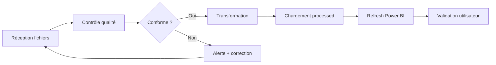

# Processus ETL & gouvernance des données

> **Référence contractuelle** : [`../../project/devis.md`](../../project/devis.md)  
> **Livrable contractuel** : documentation du processus (devis, J4)  
> **Version** : 2.1  
> **Date** : 13 juillet 2026

> **Note de version 2.1** — La section [7](#7-implémentation-technique-réelle--modèle-pbip-profitabilité) documente
> l'implémentation réellement mise en place dans le modèle PBIP `Lireka_Profitabilite`
> (requêtes Power Query, jointures, mesures). Les sections 1 à 6 décrivent le processus
> cible/gouvernance ; en cas d'écart, la section 7 fait foi pour ce qui est **construit à ce jour**.

---

## 1. Vue d'ensemble du processus



---

## 2. Processus par source

### 2.1 Factures transporteurs

| Étape | Responsable | Fréquence | Durée estimée |
|-------|-------------|-----------|---------------|
| 1. Téléchargement factures CSV | Lireka (logistique) | Mensuel | — |
| 2. Dépôt dans `data/raw/transporteurs/{nom}/` | Lireka ou ZineInsights | Mensuel | 5 min |
| 3. Exécution script ETL | ZineInsights | Mensuel | 10 min |
| 4. Validation rapport qualité | ZineInsights | Mensuel | 15 min |
| 5. Refresh dataset Power BI | ZineInsights | Mensuel | 5 min |
| 6. Vérification dashboards | Lireka (logistique) | Mensuel | 15 min |

**SLA** : Données du mois M disponibles en dashboard avant le 10 du mois M+1.

### 2.2 Export commandes backend

| Étape | Responsable | Fréquence | Durée estimée |
|-------|-------------|-----------|---------------|
| 1. Export CSV depuis le backend | Lireka (technique) | Hebdomadaire | — |
| 2. Dépôt dans `data/raw/commandes/` | Lireka | Hebdomadaire | 5 min |
| 3. Exécution script ETL | ZineInsights | Hebdomadaire | 10 min |
| 4. Validation + refresh Power BI | ZineInsights | Hebdomadaire | 10 min |

**SLA** : Données disponibles sous 48h après export.

---

## 3. Contrôles qualité

### 3.1 Règles de validation — Factures

| ID | Règle | Sévérité | Action si échec |
|----|-------|----------|-----------------|
| F01 | Fichier non vide | 🔴 Bloquant | Rejet + alerte |
| F02 | Colonnes obligatoires présentes | 🔴 Bloquant | Rejet + alerte |
| F03 | `numero_suivi` non null | 🔴 Bloquant | Ligne exclue + log |
| F04 | `cout_transport` ≥ 0 | 🔴 Bloquant | Ligne exclue + log |
| F05 | `date_facture` format valide | 🔴 Bloquant | Ligne exclue + log |
| F06 | Pas de doublon `id_facture` | 🟡 Warning | Garder plus récent |
| F07 | `poids` > 0 si renseigné | 🟡 Warning | Log |
| F08 | `transporteur` dans liste autorisée | 🔴 Bloquant | Rejet |

### 3.2 Règles de validation — Commandes

| ID | Règle | Sévérité | Action si échec |
|----|-------|----------|-----------------|
| C01 | Fichier non vide | 🔴 Bloquant | Rejet + alerte |
| C02 | Colonnes obligatoires présentes | 🔴 Bloquant | Rejet + alerte |
| C03 | `id_commande` unique | 🔴 Bloquant | Garder plus récent |
| C04 | `ca_ht` ≥ 0 | 🔴 Bloquant | Ligne exclue + log |
| C05 | `date_commande` format valide | 🔴 Bloquant | Ligne exclue + log |
| C06 | `numero_suivi` renseigné si expédié | 🟡 Warning | Log |
| C07 | `pays_livraison` code ISO valide | 🟡 Warning | Log |

### 3.3 Rapport qualité

Chaque exécution ETL produit un rapport dans `data/staging/reports/` :

```
=== Rapport ETL — {source} — {date} ===
Fichier source    : {filename}
Lignes source     : {n}
Lignes valides    : {n} ()
Doublons          : {n}
Alertes           : {liste}
Durée             : {seconds}s
Statut            : OK / WARNING / ERREUR
```

---

## 4. Gouvernance des données

### 4.1 Rôles

| Rôle | Responsabilités |
|------|----------------|
| **Data Owner** (Lireka) | Valide la définition des données, arbitre les règles métier |
| **Data Steward** (ZineInsights) | Maintient la qualité, exécute les ETL, documente |
| **Data Consumer** (Lireka) | Utilise les dashboards, remonte les anomalies |

### 4.2 Cycle de vie des données

| Phase | Durée | Emplacement | Action |
|-------|-------|-------------|--------|
| Brut | 3 mois | `data/raw/` | Suppression automatique |
| Staging | 1 mois | `data/staging/` | Suppression après validation |
| Processed | 24 mois | `data/processed/` | Archivage puis suppression |
| Power BI | Continu | Service cloud | Refresh selon fréquence |

### 4.3 Gestion des anomalies

```
1. Détection (script validation ou utilisateur)
2. Log dans le rapport qualité
3. Si bloquant → notification ZineInsights → Lireka
4. Correction source ou adaptation ETL
5. Re-exécution pipeline
6. Documentation de l'incident
```

---

## 5. Convention de nommage des fichiers

### Factures transporteurs

```
{transporteur}_factures_{YYYYMM}.csv

Exemples :
  dhl_factures_202606.csv
  la-poste_factures_202606.csv
  colis-prive_factures_202606.csv
  chronopost_factures_202606.csv
```

### Commandes

```
commandes_{YYYYMMDD}.csv

Exemple :
  commandes_20260710.csv
```

### Fichiers processed

```
data/processed/transporteurs/factures_unifiees.csv
data/processed/commandes/commandes_clean.csv
```

---

## 6. Procédure de refresh Power BI

### Manuel (Phase initiale)

1. Vérifier que les fichiers processed sont à jour
2. Ouvrir Power BI Service → workspace concerné
3. Sélectionner le dataset → **Refresh now**
4. Vérifier le statut (succès / échec)
5. Contrôler les chiffres clés sur le dashboard

### Automatisé (recommandation future)

- Power Automate : déclenchement après dépôt fichier
- Ou : Scheduled refresh dans Power BI Service

---

## 7. Implémentation technique réelle — modèle PBIP Profitabilité

> Cette section reflète ce qui est **réellement construit** dans
> `powerbi/Lireka_Profitabilite.SemanticModel/` (format PBIP / TMDL).
> Aucun visuel de page n'est inclus (construction manuelle dans Power BI Desktop).

### 7.1 Audit des dashboards existants (DHL / FedEx / UPS)

Les dashboards transporteurs existants ne sont **pas** disponibles en `.pbix` dans le dépôt :
seuls figurent leurs **CSV** (factures brutes, sources, données nettoyées) et une **documentation PDF**.
Il n'existe donc aucun modèle TMDL/M existant à copier ; les conventions ci-dessous ont été
établies en cohérence avec les documents de travail du projet (`dictionnaire-donnees.md`,
`modeles-semanticques.md`).

Constats structurants de l'audit :

| Source | Champ « numéro de suivi » | Champ coût | Format |
|--------|---------------------------|-----------|--------|
| DHL (02_Données_Sources) | `Shipment Number` | `Total amount (excl. VAT)` | CSV EN, point décimal |
| UPS (03_Documentation/data.csv) | `Numéro d'envoi` (`1Z…`) | `Somme de Prix net` (`"31,77 €"`) | CSV FR |
| Colissimo (récap) | `N° de colis` (`6A…`) | `TOTAL HT` | CSV FR, `;`, virgule décimale |
| Chronopost (récap) | `N° de colis` (`XW/XA/XS…FR`) | `TOTAL HT` | CSV FR, `;`, virgule décimale |

> Chaque transporteur a historiquement son **propre dossier/pipeline** (Factures brutes →
> Sources → Données nettoyées). Le présent modèle **unifie** ces sources dans un seul modèle
> de profitabilité, sans recréer de dashboard transporteur dédié (hors périmètre devis).

### 7.2 Sources réellement consommées

Racine paramétrable (paramètre Power Query `DossierDonnees`, valeur par défaut) :
`C:\Users\Otmane\Documents\lireka\Power_BI_Datawarehouse`

| Table modèle | Fichier source | Séparateur / décimale |
|--------------|----------------|-----------------------|
| `fact_commandes` | `Données_Backend\customer_order.csv` | `,` / point |
| `fact_transport` | `Données_Backend\package.csv` | `,` / point |
| `fact_lignes` | `Données_Backend\customer_order_item_group.csv` | `,` / point |
| `stg_Commande_Items` (staging, non chargé) | `Données_Backend\customer_order_item.csv` | `,` / point |
| `fact_factures_transport` | `Dashboards_transporteurs\COLISSIMO…\2025 & 2026 récap.csv` + `CHRONOPOST…\2025 & 2026 récap.csv` | `;` / virgule (culture `fr-FR`) |
| `dim_pays`, `dim_type_commande` | dérivées de `customer_order.csv` (valeurs distinctes) | — |
| `dim_transporteur` | table statique (référentiel) | — |
| `dim_date` | générée (2022-01-01 → 2026-12-31) | — |

> **Gouvernance** : tous ces CSV sont **exclus de Git** (`.gitignore` : `Power_BI_Datawarehouse/**`).
> Seules les définitions TMDL/M (texte) sont versionnées. Aucune donnée brute n'est commitée.

### 7.3 Normalisation des transporteurs

Aucune colonne transporteur n'existe côté backend : le transporteur est **inféré du
numéro de suivi** par la fonction `fnNormaliserTransporteur` (`definition/expressions.tmdl`),
alignée sur l'analyse du 12/07/2026 :

| Motif `tracking_id` | Transporteur canonique |
|---------------------|------------------------|
| `1Z…` | UPS |
| `6A…` (13 car.) | La Poste (Colissimo) |
| `Q013…` | Postes Canada |
| `XW/XA/XS/XR…` (13 car.) | Chronopost |
| Numérique 18 | FedEx |
| Numérique 12 | DHL |
| `Z8…`, `1C…`, numérique 8-9 | Colis Privé |
| autre / vide | INCONNU |

Alias textuels réduits par `fnCanonTransporteur` : `DHL EXPRESS`→DHL, `UPS Standard`→UPS,
`My Delivengo`/`Delivengo`/`Colissimo`→La Poste, `Canada Post`→Postes Canada.

> **Limite connue** : les identifiants purement numériques à **10 chiffres** restent ambigus
> (DHL minoritaire vs INCONNU) et sont classés `INCONNU` — à valider si un enjeu apparaît.

### 7.4 Jointures (relations TMDL)

Fichier : `definition/relationships.tmdl`.

- `fact_transport[order_id]` → `fact_commandes[id_commande]` (clé principale colis↔commande — 0 orphelin constaté)
- `fact_lignes[order_id]` → `fact_commandes[id_commande]`
- `fact_commandes` → `dim_pays` / `dim_type_commande` / `dim_date`
- `fact_transport` → `dim_transporteur` ; `fact_factures_transport` → `dim_transporteur` / `dim_date`
- **Pas de relation physique** `numero_suivi` factures↔colis : des doublons existent côté colis
  (ex. `25733367`) — Power BI exige l'unicité côté « un ». La jointure factures↔commandes
  du devis est portée par des mesures de contrôle (rapprochement virtuel `TREATAS` :
  `Coût Facturé Rapproché`, `Nb Colis Avec Facture`).

### 7.5 Mesures et marge brute (⚠️ provisoire)

Toutes les mesures sont regroupées dans la table `_Mesures` (`definition/tables/_Mesures.tmdl`) :
`CA Total HT`, `Coût Transport Réel`, `Coût Transport Estimé`, `Écart Coût Transport`,
`Marge Brute (prov.)`, `Taux Matching`, `Nb Commandes`, `Coût Facturé Rapproché`, etc.

> **⚠️ `Marge Brute (prov.)` = CA HT − Coût d'achat − Coût transport réel.**
> Formule **provisoire** : un écart a été constaté le 12/07/2026 entre ce calcul simple et
> `gross_profit_eur` existant (0 % de correspondance à ±0,01 € sur l'échantillon).
> La mesure `Marge Brute Backend (réf.)` et `Écart Marge vs Backend` sont fournies pour
> arbitrage. **À valider avec Marc / finance avant toute diffusion.**

### 7.6 Axes du dashboard de profitabilité

1 seul dashboard, 2 axes d'analyse (conformément au devis, cf. historique récent du dépôt) :
- **Par pays** : `dim_pays` (code, nom, zone géo, continent)
- **Par type de commande** : `dim_type_commande` (dérivé de `source` — interprétation à valider avec Lireka)

---

*Processus à affiner après les premiers cycles d'import.*
