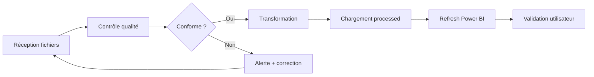

# Processus ETL & gouvernance des données

> **Référence contractuelle** : [`../../project/devis.md`](../../project/devis.md)  
> **Livrable contractuel** : documentation du processus (devis, J4)  
> **Version** : 2.0  
> **Date** : 12 juillet 2026

---

## 1. Vue d'ensemble du processus



---

## 2. Processus par source

### 2.1 Factures transporteurs

| Étape | Responsable | Fréquence | Durée estimée |
|-------|-------------|-----------|---------------|
| 1. Téléchargement factures CSV | Lireka (logistique) | Mensuel | — |
| 2. Dépôt dans `data/raw/transporteurs/{nom}/` | Lireka ou ZineInsights | Mensuel | 5 min |
| 3. Exécution script ETL | ZineInsights | Mensuel | 10 min |
| 4. Validation rapport qualité | ZineInsights | Mensuel | 15 min |
| 5. Refresh dataset Power BI | ZineInsights | Mensuel | 5 min |
| 6. Vérification dashboards | Lireka (logistique) | Mensuel | 15 min |

**SLA** : Données du mois M disponibles en dashboard avant le 10 du mois M+1.

### 2.2 Export commandes backend

| Étape | Responsable | Fréquence | Durée estimée |
|-------|-------------|-----------|---------------|
| 1. Export CSV depuis le backend | Lireka (technique) | Hebdomadaire | — |
| 2. Dépôt dans `data/raw/commandes/` | Lireka | Hebdomadaire | 5 min |
| 3. Exécution script ETL | ZineInsights | Hebdomadaire | 10 min |
| 4. Validation + refresh Power BI | ZineInsights | Hebdomadaire | 10 min |

**SLA** : Données disponibles sous 48h après export.

---

## 3. Contrôles qualité

### 3.1 Règles de validation — Factures

| ID | Règle | Sévérité | Action si échec |
|----|-------|----------|-----------------|
| F01 | Fichier non vide | 🔴 Bloquant | Rejet + alerte |
| F02 | Colonnes obligatoires présentes | 🔴 Bloquant | Rejet + alerte |
| F03 | `numero_suivi` non null | 🔴 Bloquant | Ligne exclue + log |
| F04 | `cout_transport` ≥ 0 | 🔴 Bloquant | Ligne exclue + log |
| F05 | `date_facture` format valide | 🔴 Bloquant | Ligne exclue + log |
| F06 | Pas de doublon `id_facture` | 🟡 Warning | Garder plus récent |
| F07 | `poids` > 0 si renseigné | 🟡 Warning | Log |
| F08 | `transporteur` dans liste autorisée | 🔴 Bloquant | Rejet |

### 3.2 Règles de validation — Commandes

| ID | Règle | Sévérité | Action si échec |
|----|-------|----------|-----------------|
| C01 | Fichier non vide | 🔴 Bloquant | Rejet + alerte |
| C02 | Colonnes obligatoires présentes | 🔴 Bloquant | Rejet + alerte |
| C03 | `id_commande` unique | 🔴 Bloquant | Garder plus récent |
| C04 | `ca_ht` ≥ 0 | 🔴 Bloquant | Ligne exclue + log |
| C05 | `date_commande` format valide | 🔴 Bloquant | Ligne exclue + log |
| C06 | `numero_suivi` renseigné si expédié | 🟡 Warning | Log |
| C07 | `pays_livraison` code ISO valide | 🟡 Warning | Log |

### 3.3 Rapport qualité

Chaque exécution ETL produit un rapport dans `data/staging/reports/` :

```
=== Rapport ETL — {source} — {date} ===
Fichier source    : {filename}
Lignes source     : {n}
Lignes valides    : {n} ()
Doublons          : {n}
Alertes           : {liste}
Durée             : {seconds}s
Statut            : OK / WARNING / ERREUR
```

---

## 4. Gouvernance des données

### 4.1 Rôles

| Rôle | Responsabilités |
|------|----------------|
| **Data Owner** (Lireka) | Valide la définition des données, arbitre les règles métier |
| **Data Steward** (ZineInsights) | Maintient la qualité, exécute les ETL, documente |
| **Data Consumer** (Lireka) | Utilise les dashboards, remonte les anomalies |

### 4.2 Cycle de vie des données

| Phase | Durée | Emplacement | Action |
|-------|-------|-------------|--------|
| Brut | 3 mois | `data/raw/` | Suppression automatique |
| Staging | 1 mois | `data/staging/` | Suppression après validation |
| Processed | 24 mois | `data/processed/` | Archivage puis suppression |
| Power BI | Continu | Service cloud | Refresh selon fréquence |

### 4.3 Gestion des anomalies

```
1. Détection (script validation ou utilisateur)
2. Log dans le rapport qualité
3. Si bloquant → notification ZineInsights → Lireka
4. Correction source ou adaptation ETL
5. Re-exécution pipeline
6. Documentation de l'incident
```

---

## 5. Convention de nommage des fichiers

### Factures transporteurs

```
{transporteur}_factures_{YYYYMM}.csv

Exemples :
  dhl_factures_202606.csv
  la-poste_factures_202606.csv
  colis-prive_factures_202606.csv
  chronopost_factures_202606.csv
```

### Commandes

```
commandes_{YYYYMMDD}.csv

Exemple :
  commandes_20260710.csv
```

### Fichiers processed

```
data/processed/transporteurs/factures_unifiees.csv
data/processed/commandes/commandes_clean.csv
```

---

## 6. Procédure de refresh Power BI

### Manuel (Phase initiale)

1. Vérifier que les fichiers processed sont à jour
2. Ouvrir Power BI Service → workspace concerné
3. Sélectionner le dataset → **Refresh now**
4. Vérifier le statut (succès / échec)
5. Contrôler les chiffres clés sur le dashboard

### Automatisé (recommandation future)

- Power Automate : déclenchement après dépôt fichier
- Ou : Scheduled refresh dans Power BI Service

---

*Processus à affiner après les premiers cycles d'import.*
