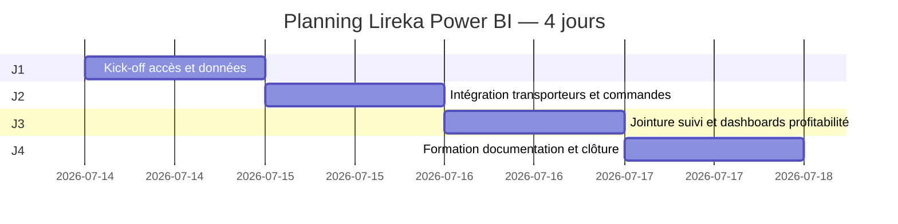

# Planning de mission — Lireka × ZineInsights

> **Formule de marge actée** (Slack Marc Bordier, 13/07/2026) — voir [`perimetre-verrouille.md`](perimetre-verrouille.md).

> **Durée** : **4 jours** (forfait 1 800 € HT)  
> **Référence contractuelle** : [`devis.md`](devis.md)  
> **Chef de projet** : Otmane Boulahia (ZineInsights)

---

## Vue d'ensemble

---

## Jour 1 — Kick-off, accès & données

| Activité | Livrable |
|----------|----------|
| Kick-off Marc Bordier (30–45 min) | CR kick-off |
| Obtention accès Power BI + SharePoint (`Power_BI_Datawarehouse/`) | Checklist accès complétée |
| Analyse rapide formats factures (La Poste, Colis Privé, Chronopost) | Mapping champs documenté |
| Réception export commandes backend sur SharePoint | CSV `Données_Backend/` disponibles |
| Premier refresh Power BI Desktop (`.pbip`) sur données réelles | Modèle chargé sans erreur bloquante |

**Jalon J1** : ✅ Accès obtenus, données sur SharePoint, refresh PBIX réussi

---

## Jour 2 — Intégration Power BI

| Activité | Livrable |
|----------|----------|
| Intégration des 3 transporteurs manquants dans Power BI | Données La Poste, Colis Privé, Chronopost dans le modèle |
| Import et structuration dataset commandes | Dataset commandes publié |
| Reprise du modèle existant DHL/FedEx/UPS comme référence | — |

**Jalon J2** : ✅ Transporteurs + commandes disponibles dans Power BI

---

## Jour 3 — Jointure & profitabilité

| Activité | Livrable |
|----------|----------|
| Jointure factures ↔ commandes par `numero_suivi` | Relation opérationnelle |
| Mesures marge brute (coût transport réel) | Mesures DAX |
| **Dashboard profitabilité** — marge brute par **pays** et par **type de commande** (2 axes d'analyse, structure au choix du prestataire) | Rapport Power BI |

**Jalon J3** : ✅ Dashboard profitabilité fonctionnel (2 axes d'analyse couverts)

---

## Jour 4 — Formation, documentation & clôture

| Activité | Livrable |
|----------|----------|
| Session formation utilisateurs *(si disponibilité équipes Lireka)* | CR formation |
| Documentation du processus (refresh SharePoint, limites) | `docs/04-processus/processus-etl-gouvernance.md` |
| Point de clôture avec Marc Bordier | Mission livrée |

**Jalon J4** : ✅ Forfait livré et validé

---

## Réunions

| Réunion | Moment | Durée | Participants |
|---------|--------|-------|--------------|
| Kick-off | J1 matin | 30–45 min | Marc + Otmane |
| Point mi-mission | J2 ou J3 | 15–30 min | Marc + Otmane |
| Clôture | J4 fin de journée | 30 min | Marc + Otmane |

---

## Dépendances critiques

| Dépendance | Côté | Impact si retard |
|------------|------|------------------|
| Accès workspace Power BI | Lireka | Bloque J2 |
| Factures CSV (3 transporteurs) | Lireka | Bloque J1–J2 |
| Export CSV commandes | Lireka | Bloque J2–J3 |
| Formule marge brute | ✅ Actée (Slack Marc, 13/07/2026) — voir `perimetre-verrouille.md` | — |
| Disponibilité participants formation | Lireka | Reporte formation J4 |

---

*Dates indicatives — à ajuster au démarrage réel.*
